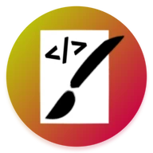
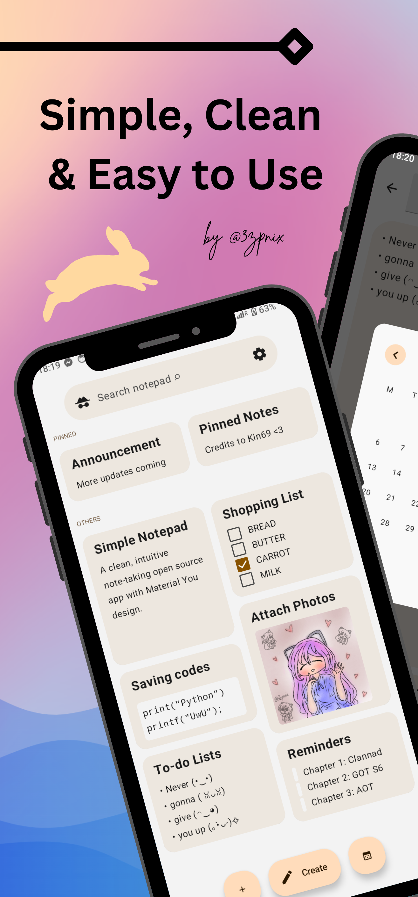
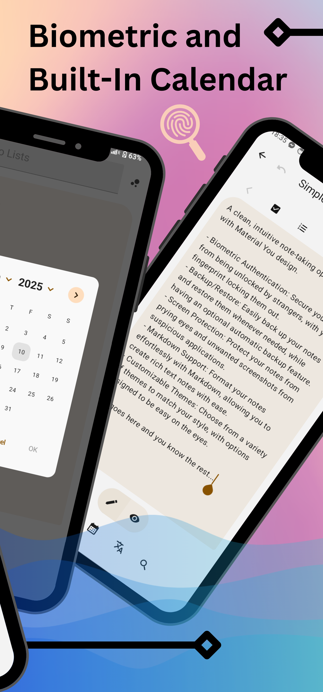
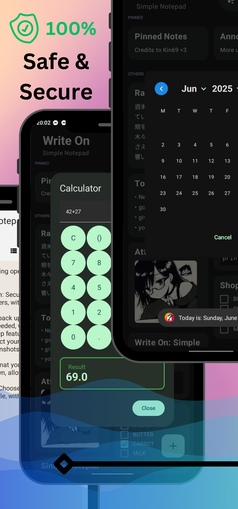
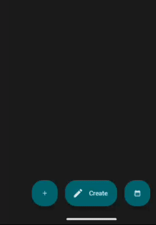

(⁠≧⁠▽⁠≦⁠)
<h3>Version 1.2 Coming Soon! (⁠≧⁠▽⁠≦⁠)</h3>

 

### Write On: Simple Notepad ✅
A clean, intuitive note-taking open source app with Material You design.

 &nbsp; 
 &nbsp;

---

    
    
    

---

## 🎉 Available Features
- Biometric Authentication: Secure your notes from being unlocked by strangers, with your fingerprint locking them out. 
- Backup/Restore: Easily back up your notes and restore them whenever needed, while having an optional automatic backup feature. 
- Screen Protection: Protect your notes from prying eyes and unwanted screenshots from suspicious applications.
- Markdown Support: Format your notes effortlessly with Markdown, allowing you to create rich text notes with ease.
- Customizable Themes: Choose from a variety of themes to match your style, with options designed to be easy on the eyes.
- Offline Functionality: Never lose your notes. As it is an ad-free & clutter-free open source application for everyone. 
- Data Privacy: Your notes are stored securely on your device, ensuring your personal data and stuff remains private.
- No Unnecessary Permissions: Enjoy peace of mind knowing that WriteOn doesn't require what is not needed.
- Intuitive UI: A user-friendly interface that keeps your notes organized and accessible.
- Built-In Calendar: Take a quick look at the calendar without switching applications.

---

## 📢 Announcements
 
- Focusing on university stuff for a while, updates will be on hold for a moment (12/7/2024)
- Upcoming version 1.2 will contain more bug fixes and features coming in (12/3/2024)
- Laptop is having issues with Android Studio, updates will be delayed a bit, sorry! (11/19/2024)
- Android release coming soon to fdroid and github (08/26/2024)

---

## 💬 For Inquiries

-  Email : ezpnix@proton.me
-  Twitter : [3zpnix](https://twitter.com/3zpnix)

---

## DevLog for v1.2 (01/05/2025)

 

- Added the ability to make a quick note then exporting the text inside to a txt file (located beside the 'Create' button)
- Updated the logic handling of the automatic backup feature a bit
- Added a way to copy the text from a note then redirecting the user to translating the text right away
- Now you can head onto your default browser to search the internet quickly by pressing a new button placed within the note
- Refurbished some of the codes to avoid any potential crashes that may happen indefinitely
- Have temporarily removed some useless features that has no use for this app (yet)
- Renamed some strings and other miscellaneous things
- More coming soon!

---
    
## ⚠️ License
    Write On: Simple Notepad

    Copyright (C)2024 3zpnix
    
    This software is free to use, modify, and redistribute under 
    the terms of the GNU General Public License, as published by the 
    Free Software Foundation. You may choose to use either version 3 of the License 
    or, at your option, any later version. The software is provided with the hope 
    that it will be useful, but it comes as is with no warranties, including 
    implied warranties of MERCHANTABILITY or FITNESS FOR A PARTICULAR PURPOSE. 
    For more details, please refer to the GNU General Public License.

    The above copyright notice, this permission notice, and the license must be included in all copies or substantial portions of the software.

    You can find a copy of the GNU General Public License v3 [here](https://www.gnu.org/licenses/)

