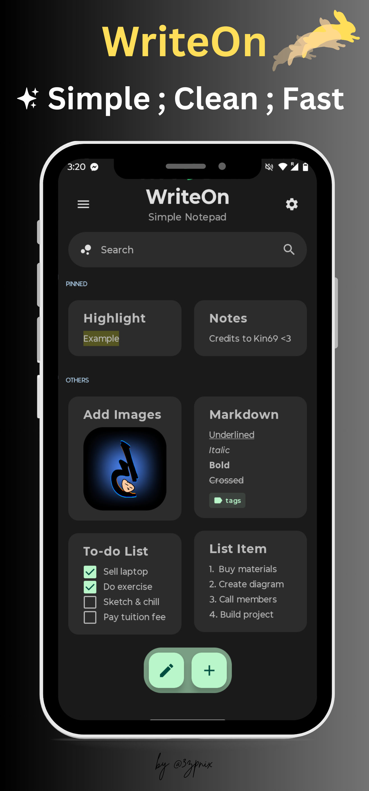

  

# Write On: Simple Notepad ✅
A clean, intuitive note-taking app with *Material You* design — open source and privacy-respecting.

&nbsp;

---

  
  
  

---

## 💥 Personal DevLog (^~^)

<strong>💥 v1.6 (2025-06-01)</strong>

- [x] New homepage user interface
- [x] More visibility on your notes
- [x] FAB has returned but cleaner now
- [x] Added new Flashcard screen feature
- [x] Column view count is now adjustable
- [x] Improvements to Scratchpad screen
- [x] Quick shortcut button redirects to Styles
- [x] Home greeting placeholder repositioned
- [x] Issue feedback now on the settings screen
- [x] Feedback screen cards now fully clickable
- [x] Added some minor animation improvements
- [x] Get info on your device found in about
- [x] Some icons were replaced to be cleaner
- [x] Bug fixes and optimizations

<strong>💥 v1.5 (2025-05-09)</strong>

- [x] Removed savenote else-function bug
- [x] Homescreen buttons surface lazyrow
- [x] Edit buttons moved to bottom modal
- [x] Calculator supports manual edits
- [x] Listed-section improvements
- [x] Fixed major crash issue

<strong>💥 v1.4 (2025-03-25)</strong>

- [x] Refactored edit/view models
- [x] Row icon buttons replace centered buttons
- [x] Added Help & Feedback section
- [x] Pin/unpin status saves properly
- [x] Fixed calculator parenthesis bug
- [x] New sections in Settings screen
- [x] DPI support improved
- [x] Updated note preview UI
- [x] Alert dialog logic revamped

<strong>💥 v1.3 (2025-02-25)</strong>

- [x] Home UI updated
- [x] Searchbar placeholder added
- [x] Custom dimensions fixed
- [x] Calculator built-in
- [x] Adjustable font size
- [x] More buttons/features
- [x] Calendar bug squashed
- [x] Renamed strings
- [x] Minor bug fixes

<strong>💥 v1.2 (2025-01-10)</strong>

- [x] More markdown support
- [x] TXT export for quick notes
- [x] Improved auto-backup logic
- [x] Translate and share buttons added
- [x] Fixed partial image bug
- [x] UI updates and optimizations

<strong>💥 v1.1 (2024-11-30)</strong>

- [x] UI Changes
- [x] Bug Fixes

---

## 📢 Announcements

- *2025-06-01:* Thankfully, I had time to continue the v1.6 update, had fun with this version, thank you!
- *2025-05-09:* Small v1.5 update released — life’s hectic with job & university, so expect some slow updates.
- *2025-02-25:* Found time for v1.3 update — future updates might be delayed due to part-time job.
- *2025-01-19:* Taking a break to focus on other projects. Still planning v1.3!
- *2024-12-07:* University workload delaying updates — sorry!
- *2024-12-03:* v1.2 will be mostly bug fixes + features.
- *2024-11-19:* Android Studio issues — delays expected.
- *2024-08-26:* Android release coming soon to GitHub and F-Droid!

---

## 💬 Contact

- *Email:* ezpnix@proton.me
- *Twitter:* [@3zpnix](https://twitter.com/3zpnix)

---

## 👋 Features

**Biometric Auth** • **Backup/Restore** • **Custom Layout** • **Markdown** •
**Built-In Calendar**  • **Offline Access** • **Privacy-Friendly** •
**No Bloat Permissions** • **Material You UI** • **Custom Themes** •
**Multiple Export Options** • **Scratchpad** • **Share Text** •
**Flashcard** • **Image Attachments** • **Calculator** • **Fonts**

---

## ⚠️ License
    Write On: Simple Notepad

    Copyright (C)2024 3zpnix
    
    This software is free to use, modify, and redistribute under 
    the terms of the GNU General Public License, as published by the 
    Free Software Foundation. You may choose to use either version 3 of the License 
    or, at your option, any later version. The software is provided with the hope 
    that it will be useful, but it comes as is with no warranties, including 
    implied warranties of MERCHANTABILITY or FITNESS FOR A PARTICULAR PURPOSE. 
    For more details, please refer to the GNU General Public License.

    The above copyright notice, this permission notice, and the license must be included in all copies or substantial portions of the software.

    You can find a copy of the GNU General Public License v3 [here](https://www.gnu.org/licenses/)

