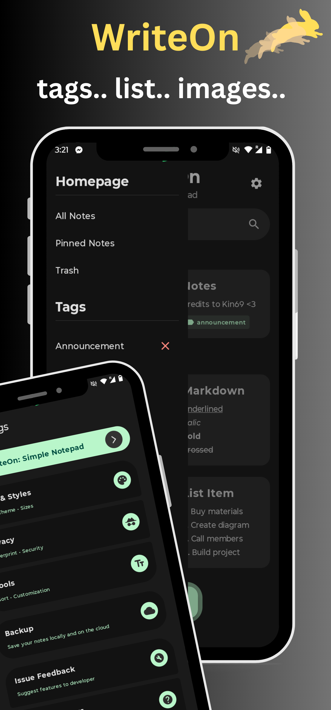

 

### Write On: Simple Notepad ✅
A clean, intuitive note-taking open source app with Material You design.

 &nbsp;
 &nbsp;

---

    
    
    

---

## 🎉 DevLog v1.2 (01/10/2025)
- [x] More markdown formats
- [x] Quick note export to txt
- [x] Updated auto-backup logic
- [x] Direct to translate button
- [x] Dropdown share button
- [x] Fixed partial image bug
- [x] Updated user interface
- [x] Internet search button
- [x] Updated resource strings
- [x] More optimizations

---

## 📢 Announcements

- Focusing on university stuff for a while, updates will be on hold for a moment (12/7/2024)
- Upcoming version 1.2 will contain more bug fixes and features coming in (12/3/2024)
- Laptop is having issues with Android Studio, updates will be delayed a bit, sorry! (11/19/2024)
- Android release coming soon to fdroid and github (08/26/2024)

---

## 💬 For Inquiries

-  Email : ezpnix@proton.me
-  Twitter : [3zpnix](https://twitter.com/3zpnix)

---

## 👋 Active Features

★ Biometric Authentication ★ Backup/Restore ★ Screen Protection ★ Markdown Support ★ Customizable Themes ★ Offline Functionality ★ Data Privacy ★ No Unnecessary Permissions ★ Intuitive UI ★ Built-In Calendar ★ Quick note export to txt ★ Direct to translate button ★ Dropdown share button ★ Internet search button ★ Attach Images 

---

## ⚠️ License
    Write On: Simple Notepad

    Copyright (C)2024 3zpnix
    
    This software is free to use, modify, and redistribute under 
    the terms of the GNU General Public License, as published by the 
    Free Software Foundation. You may choose to use either version 3 of the License 
    or, at your option, any later version. The software is provided with the hope 
    that it will be useful, but it comes as is with no warranties, including 
    implied warranties of MERCHANTABILITY or FITNESS FOR A PARTICULAR PURPOSE. 
    For more details, please refer to the GNU General Public License.

    The above copyright notice, this permission notice, and the license must be included in all copies or substantial portions of the software.

    You can find a copy of the GNU General Public License v3 [here](https://www.gnu.org/licenses/)

